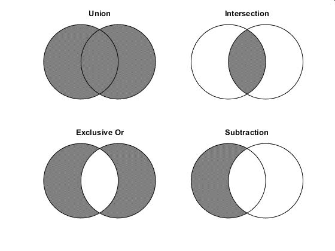

# safety_vaccine

The latest data of VAERS (Vaccine Adverse Event Reporting System) dataset is 
available at:

https://vaers.hhs.gov/eSubDownload/index.jsp?fn=2021VAERSData.zip

# set operations
vaers.py shows a good example of intersection operation. 
The following figure shows what is intersection operation.

# How to run vaers.py

<pre>
1. Unzip 2021VAERSData.zip file
2. Run vaers.py program
$ python vaers.py
total instances:  406001
non-deaths(N) or deaths(Y)
N    400604
Y      5397
Name: DIED, dtype: int64
NOVIDs instances:  109
MODERNAIDs instances:  187970
PFIZERIDs instances:  184162
intersect NOV  2
NOV 0.018
intersect MODERNA  2486
MODERNA 0.013
intersect PFIZER  2235
PFIZER 0.012
</pre>
# How to run pfizerAge.py to generate a pfizer.csv file.
<pre>
$ python pfizerAge.py
</pre>

# How to run modernaAge.py to generate a moderna.csv file.
<pre>
$ python modernaAge.py
</pre>

# How to calculate safety thresholds of PFIZER and MODERNA vaccines by age
<pre>
$ python deathperinstance.py
</pre>

